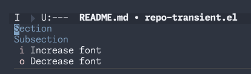
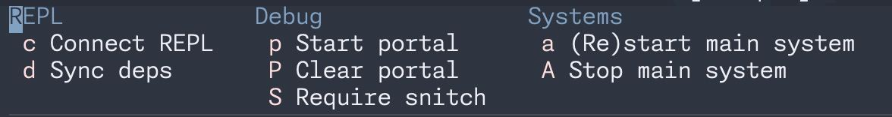

# context-transient.el
Easily create context-specific transient menus for Emacs. Context can be anything — buffer name, current git repo, current project etc. See examples.

## Usage
Once you have defined your context-specific transients, call them with `M-x context-transient RET`.

## Examples
Context transients are defined using `context-transient-define`. You can specify either `:context`, `:buffer` or `:repo` keys to check the context. 
- `:repo` - checks if the current git repo name is equal to this
- `:buffer` - checks if the current buffer name is equal to this
- `:context` - arbitrary code that will be run to check if the transient should be run

### Git repo context
This example defines a transient menu for git repos. Note the usage of `:repo` function — this is a helper function that returns `t` if the repo name is equal to it's argument. But context accepts any expression that evaluates to `t` or `nil`.
```elisp
(context-transient-define context-transient-repo
  :doc "Repo specific transient"
  :repo "context-transient.el
  :menu
  ["Section"
  ["Subsection"
   ("i" "Increase font" text-scale-increase :transient nil)
   ("o" "Decrease font" text-scale-decrease :transient nil)]])
  ```
 

### Buffer name context
The following example runs the transient if current buffer name is `*scratch*`:
```elisp
(context-transient-define itch
  :doc "Itch a *scratch*"
  :buffer "*scratch*"
  :menu
  [["Test" ("i" "Itch *scratch*" (lambda () (interactive) (message "Itched")))]])
```

### Any expression context
You can run any lisp expression in `:context`. For example, transient only works on Thursdays:

```elisp
(context-transient-define thursdays-transient
  :doc "Only show this menu on Thursdays"
  :context (equal "Thursday" (format-time-string "%A"))
  :menu
  [["Thursday!"
    ("t" "Once a week" (lambda () (interactive) (message "IT IS THURSDAY!")))]])
 ``` 

### Clojure Specific Example
You need to be a bit more verbose to use it to run interactive CIDER commands while working on a Clojure project:
```elisp
(context-transient-define my-clj-transient
  :doc "Transient for my-clj-repo"
  :repo "my-clj-repo"
  :menu 
  [["REPL"
   ("c" "Connect REPL" (lambda () (interactive) (cider-connect-clj '(:host "localhost" :port 63000))) :transient nil)
   ("d" "Sync deps" (lambda () (interactive) (cider-interactive-eval "(sync-deps)")))]
  ["Debug"
   ("p" "Start portal" (lambda () (interactive) (cider-interactive-eval "(user/portal)")))
   ("P" "Clear portal" (lambda () (interactive) (cider-interactive-eval "(user/portal-clear)")))
   ("S" "Require snitch" (lambda () (interactive) (cider-interactive-eval "(require '[snitch.core :refer [defn* defmethod* *fn *let]])")))]
  ["Systems"
   ("a" "(Re)start main system" (lambda () (interactive) (cider-interactive-eval "(user/restart-sync)")))
   ("A" "Stop main system" (lambda () (interactive) (cider-interactive-eval "(user/restart-sync)")))]])
 ```


## Clearing context-transients
If for some reason a previously defined transient misbehaves, you can clear all context transients by running `M-x context-transient-clear RET`

## Installing
Using use-package and elpaca:
```elisp
(use-package context-transient
  :elpaca (:type git :host github :repo "licht1stein/context-transient.el")
  :defer nil
  :bind ("<f6>" . context-transient))
```
I recommend binding `context-transient` to something easily accessible, F6 in the example above.

## Thanks
This library started as a variation on my [repo-hydra.el](https://github.com/licht1stein/repo-hydra.el) library. If you have Emacs 29.1 or later transient is built-in, so there are no external dependencies. But thanks to the help from [Nicholas Vollmer (@progfolio)](https://github.com/progfolio) it became a much more useful tool.
